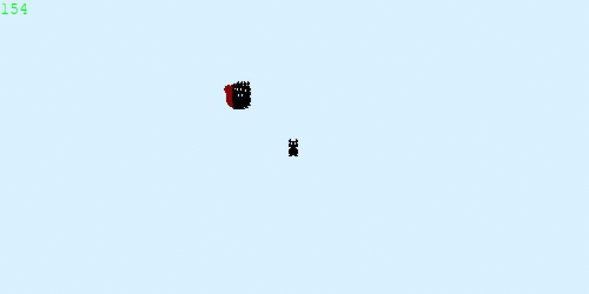

# Patrick Pygame Framework
### This is deprecated project, and will probably never be finished

## Sample Scene In [main.py](main.py)


## Quick start [On windows via CMD or powershell assuming you have git and python]

- Clone git repo (assumes you have git)
  - run ```git clone https://github.com/Sywth/patrick.git name_of_your_project``` from a folder where you want to work with the framework 
  - get into the folder via ```cd name_of_your_project```
- Create a virtual python environment (Built on python 3.19 +) 
  - run ```python -m venv .venv ``` to create a virtual environment in the root of the project called ```.venv```
  - run ```.venv\Scripts\activate``` to activate the virtual environment
  - run ```pip install -r requirements.txt``` to install the requirements
- Edit and run
  - edit main.py how you see fit 
  - with the virtual environment activated run ```python main.py``` from the root of the project
